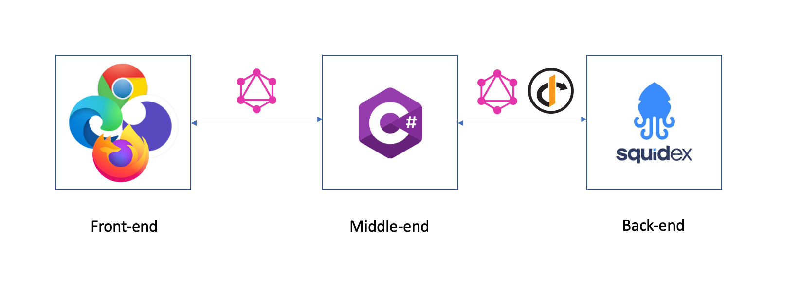
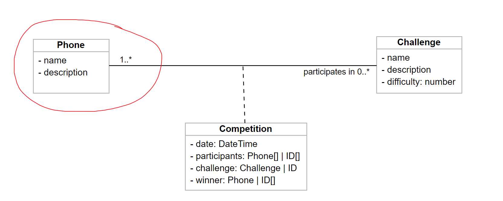

# Middle Stage Phone PK

The field test includes a .Net middle-end server that delegates requests to the upstream back-end powered by [Squidex][squidex].


_Data flow_

The app loads from and saves data to the upstream by a GraphQL client, which requests the endpoint of Squidex. The authentication is managed by Identity Server (OAuth 2).

It also creates a GraphQL server which provides an endpoint for downstream front-end clients to interact with.

## Data model

https://online.visual-paradigm.com/share.jsp?id=3339333830332d38

The size of the demo is intended to be small, therefore only the `Phone` model in the diagram is implemented.


_Data model_

Note that the data model definitions are different between Squidex and this App. The conversion is made within each data service.

## Dependencies

``` xml
    <PackageReference Include="GraphQL.Client" Version="5.1.0" />
    <PackageReference Include="GraphQL.Client.Serializer.SystemTextJson" Version="5.1.0" />
    <PackageReference Include="GraphQL.MicrosoftDI" Version="7.0.1" />
    <PackageReference Include="GraphQL.Server.Transports.AspNetCore" Version="7.0.0" />
    <PackageReference Include="GraphQL.SystemTextJson" Version="7.0.1" />
    <PackageReference Include="IdentityModel.AspNetCore" Version="4.3.0" />
    <PackageReference Include="Microsoft.Extensions.DependencyInjection" Version="6.0.0" />
```

## Test it out

### Set up back-end

You'll first need a Squidex back-end up and running. One quick approach is to deploy the metadata via [Squidex CLI][squidexCLIDocumentation].

- Log in onto [Squidex Cloud][squidexCloudApps], and create a new instance `middle-stage-phone-pk`
- Open the app, go to Settings -> Clients, and record the default `Client ID` and `Client Secret`.
- Download [Squidex CLI][squidexCLIDownload].
- Add an app configuration:
  - ``` shell
      sq config add middle-stage-phone-pk middle-stage-phone-pk:default [CLIENT_SECRET]
      sq config list
      # Then you should find your app in the list
      # Enable the new config, just in case
      sq config use middle-stage-phone-pk
    ```
- Deploy metadata to the back-end
  - ``` shell
      sq sync in ./backendMetadata/middle-stage-phone-pk
      # Successful if outputting "> Synchronization completed."
    ```
- Go to Content Tab. You should now see all the schemas with their data inside.

### Set up front-end

Use the [insomnia client][insomniaClient] to import `docs/insomnia-api-middle-stage-phone-pk.json`.

Then you will have all the endpoints available.

### Test the middle-end

Create a .Net User secret (or `appsettings.Production.json` based on your environment) with the following content:

``` json
{
  "backendAuthURL": "https://cloud.squidex.io/identity-server/connect/token",
  "backendAuthClientID": "middle-stage-phone-pk:default",
  "backendAuthClientSecret": "[CLIENT_SECRET]",
  "backendAuthClientScope": "squidex-api",
  "backendBaseURL": "https://cloud.squidex.io/api/content/middle-stage-phone-pk"
}
```

Make sure `backendAuthClientID` and `backendAuthClientSecret` match the ones in your newly deployed Squidex App.

Build and start the server, then CRUD phones.

## Data passing: Front-end to this app

One of the components of this app is the GraphQL server that accepts GraphQL requests from the front end.

It loads the GraphQL definitions from `Models/OutboundGraphs` folder, then maps them to the root graph classes (`Query`, `Mutation`).

``` csharp
builder.Services.AddSingleton<ISchema>((provider) =>
    {
        var schema = Schema.For(Graph.LoadDefinitions(), _ =>
        {
            _.Types.Include<Query>();
            _.Types.Include<Mutation>();
            _.ServiceProvider = provider;
        }
        );
        return schema;
    }
);
```

Afterward, the front end can access the server via `/graphql`.

``` csharp
app.UseGraphQL<ISchema>("/graphql");
```

The root graph classes are partial. In this way, they can be easily expandable and maintainable in individual service graphs.

The definitions in `RootGraph.cs` handles dependency injection, whereas, in `PhoneGraph.cs`, the detailed logic is implemented.

``` csharp
// RootGraph.cs
public partial class Query
{
    private readonly PhoneGraph phoneGraph;

    public Query(PhoneGraph phoneGraph)
    {
        this.phoneGraph = phoneGraph;
    }
}
```

``` csharp
// PhoneGraph.cs
public partial class Query
{
    [GraphQLMetadata("phones")]
    public async Task<List<Phone>> GetPhones(IEnumerable<string> ids)
        => await phoneGraph.Get(ids);
}
```

## Data passing: this app to upstream

Just like `DbContext` class that we usually create in a normal .Net backend project, this time we have `GraphQLClientContext` class, which takes care of the data interaction between this app and upstream.

The class leverages a special `HttpClient` managed by `IdentityServer`, with the BEARER token presented and always up to date. In addition, the endpoint to the back-end has been set, and a `GraphQLClient` has been created and stored in the class.

``` csharp
public class GraphQLClientContext : IGraphQLClientContext
{
    private readonly HttpClient httpClient;
    private readonly Uri endPoint;
    public GraphQLHttpClient Client { get; init; }
    
    public GraphQLClientContext(IHttpClientFactory factory)
    {
        httpClient = factory.CreateClient("client");
        endPoint = new Uri($"{httpClient.BaseAddress}/graphql");

        Client = new GraphQLHttpClient(
            new GraphQLHttpClientOptions
            {
                EndPoint = endPoint,
                //...
            },
            new SystemTextJsonSerializer(/** ... **/),
            httpClient
        );
    }
}

```

The context will be used later by `DataAccessService`.

``` csharp
// DataAccessService.cs
public class DataAccessService : IDataAccessService
{
    private readonly GraphQLHttpClient client;
    private readonly ILogger<DataAccessService> logger;

    public DataAccessService(
        ILogger<DataAccessService> logger,
        IGraphQLClientContext clientContext
    )
    {
        this.logger = logger;
        client = clientContext.Client;
    }
}
```

The `DataAccessService` defines a general way of sending CRUD GraphQL requests to upstream.

``` csharp
public interface IDataAccessService
{
    Task<SquidexQueryTypes> QueryContentsByIDs(/** ... **/);
    Task<IEnumerable<SquidexMutationTypes>> CreateContents<T>(/** ... **/);
    Task<IEnumerable<SquidexMutationTypes>> UpdateContents<T>(/** ... **/);
    Task<IDictionary<string, SquidexMutationTypes>> DeleteContents(/** ... **/);
}
```

It is later injected into individual model services (e.g. `PhoneService`) and further configured to their contexts.

``` csharp
// PhoneService.cs
public class PhoneService : IPhoneService
{
    private readonly IDataAccessService dataAccessService;

    public PhoneService(IDataAccessService dataAccessService)
    {
        this.dataAccessService = dataAccessService;
    }
}
```

Unfortunately, a big drawback of Squidex API is the lack of bulk support for Mutation operations. The current approach is sending one request for each object one after another, which would waste a lot of bandwidth if the number is large. A possible workaround is using the Squidex CLI, but this is still under discovery.

## Mock end-to-end test

The app has end-to-end tests powered by [Moq][moq].

Instead of sending real API requests upstream, the tests create mock services and mock these requests locally.

Each mock service extends its real service but specifies what would be the input and mock output for `IDataAccessService` methods used in each service method.

``` csharp
// MockPhoneService.cs
public class MockPhoneService : PhoneService
{
    private static MockPhoneService _instance;

    public MockPhoneService(): base(SetupMock()){ }

    public static IDataAccessService SetupMock()
    {
        Mock<IDataAccessService> mock = new();
        Build()
            .SetupCreateContents(mock)
            .SetupQueryContentsByIDs(mock)
            .SetupUpdateContents(mock)
            .SetupDeleteContents(mock);
        return mock.Object;
    }

    private static MockPhoneService Build()
    {
        if (_instance is null)
        {
            _instance = new MockPhoneService();
        }
        return _instance;
    }
    // ... Set up each method input/output
}
```

The mock service is then logged in dependency injection.

``` csharp
// ServiceFixture.cs
public class ServiceFixture
{
    public IHost TestHost { get; set; }
    public ServiceFixture()
    {
        TestHost = Host.CreateDefaultBuilder()
            .ConfigureServices((context, services) =>
            {
                // add services
                services.AddSingleton<IPhoneService, MockPhoneService>();
            })
            .Build();
    }
}
```

Afterward, the test uses the backing mock service as usual, similar to what it does in a normal integration test to a database.

``` csharp
// PhoneTest.cs
public class PhoneTest : IClassFixture<ServiceFixture>
{
    private readonly IHost testHost;
    private readonly IPhoneService phoneService;

    public PhoneTest(ServiceFixture fixture)
    {
        testHost = fixture.TestHost;
        phoneService = testHost.Services.GetService<IPhoneService>()!;
    }

    // ... Tests and Class Data
}
```


<!-- Links -->
[squidex]: https://squidex.io/
[squidexCLIDocumentation]: https://docs.squidex.io/02-documentation/developer-guides/automation-tools
[squidexCloudApps]: https://cloud.squidex.io/
[squidexCLIDownload]: https://github.com/Squidex/squidex-samples/releases
[insomniaClient]: https://insomnia.rest/
[moq]: https://github.com/moq/moq4
